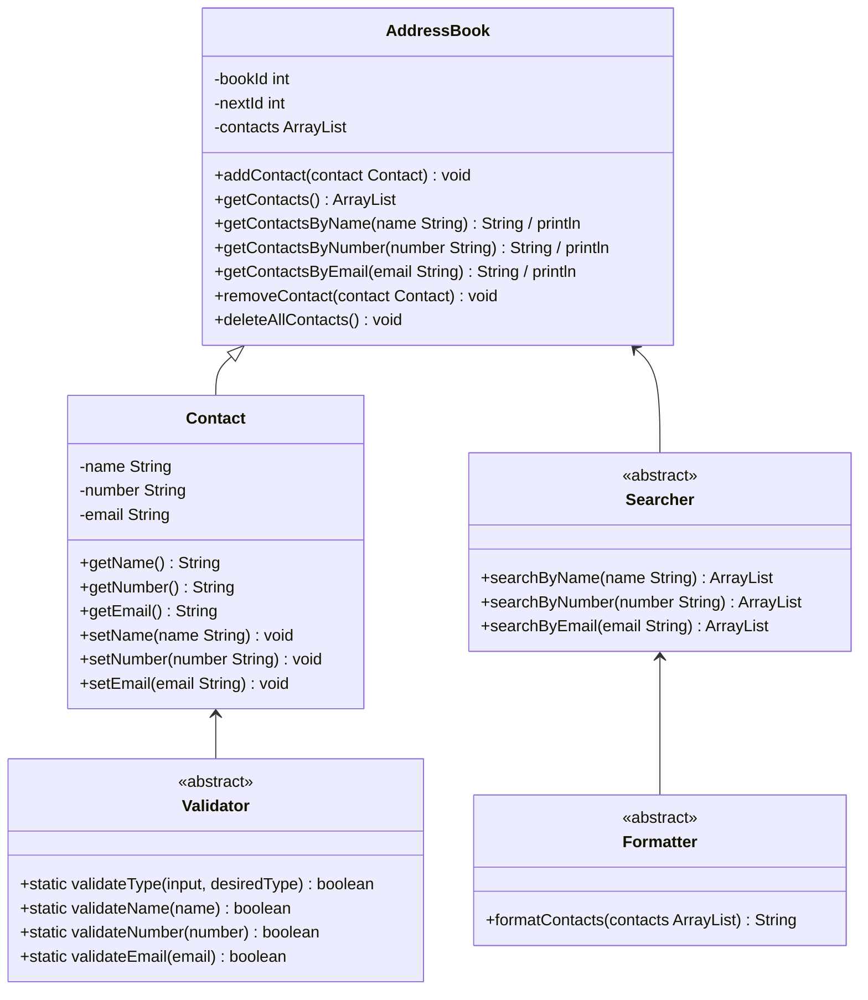

# Domain Models, Class Diagrams and Test Plan

## User Stories

As a user I want to be able to add a contact to my address book, so that I can store their info.

As a user I don't want to be able to add a contact without their information properly entered, so that I don't accidentally add contacts early.

As a user I want to be able to see all the contacts in my address book, so that I know who is there at a glance.

As a user I want to be able to search my contacts by name, so that I can find specific ones quickly.

As a user I want to be able to remove a contact from my address book, so that it doesn't get cluttered if I don't need their info anymore.

As a user I don't want to be able to remove a contact from my address book that does not exist, so I don't think I've deleted one by accident.

As a user I want to be able to edit a contact's details, so that I don't have to add a new contact if they change their number.

As a user I don't want to be able to add a duplicate contact, so that I'm informed if I already have that person in my address book.

As a user I want to be able to interact with my address book in a console interface, so that I can easily interact with all the functionality of it.

### Additional Stories

As a user I want to be able to search for a contact by phone number, so that I can find them if I forget their name.

As a user I want to be able to search for a contact by email address, so that I can find them if I forget their name.

As a user I want my search results to be displayed in alphabetical order, so that I can easily parse the resulting list.

As a user I want to be able to delete all my contacts at once, so that I can easily refresh my entire address book if I no longer need anyone in there.

As a user I don't want to be able to accidentally delete all my contacts at once, so I don't make a severe mistake.

***

## Co-Pilot Generated Basic Domain Model

## Class Diagram

